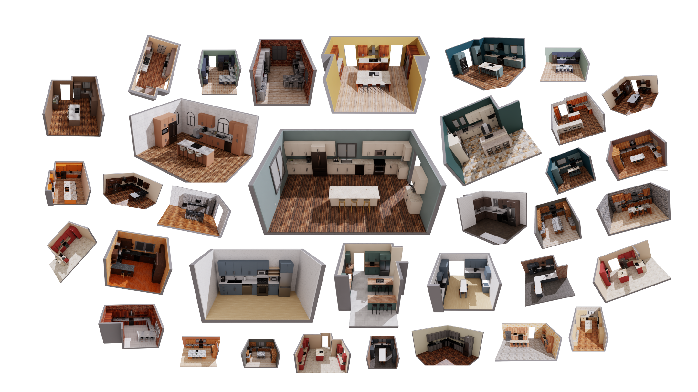
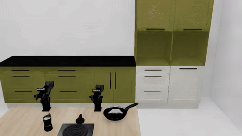
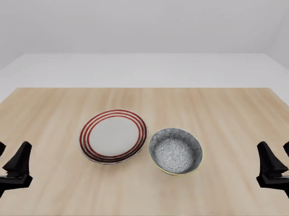

# LW BENCHHUB TOUR

> 基于光轮科技物理底座与具身智能生态的通用大模型闭环仿真测试、自适应场景生成及自生长数据飞轮技术探索。

---



## 项目简介

**LW BENCHHUB TOUR** 是一个完整的具身智能视觉-语言-动作（VLA）模型闭环仿真测试、自适应场景生成及数据自生长飞轮的技术探索项目。

本项目深度集成了光轮科技的 **`LW-BenchHub`** 统一物理底座、NVIDIA 的 **`IsaacLab-Arena`** 机器人学习框架以及 Hugging Face 的 **`lerobot`** 具身智能生态。项目通过双臂 Piper 机器人（`DoublePiper-Abs`）在厨房复杂抓取放置（PnP）任务下的闭环表现，系统性地构建并跑通了以下三个阶段（Stage）的具身智能数据与评测闭环：

*   **Stage 1（VLA 闭环仿真评测基线）**：在一台无 GUI 显卡服务器上部署轻量化 VLA 策略网络，并与物理仿真底座实现感知和控制的高频闭环，确立基础任务的成功率评测基线。
*   **Stage 2（LLM 驱动的场景自适应生成）**：引入大语言模型自适应裂变生成多样化测试场景，并使用 cuRobo 工作空间逆运动学（IK）作为“物理可达性闸门”进行自动化场景过滤。
*   **Stage 4（自过滤数据自生成飞轮）**：构建 OOD 极难场景，通过失败自动诊断、课程学习（Curriculum）场景梯度生成，以及 VLA 模型閉环自过滤（Self-Filtering）机制，实现数据采集与闭环进化的自循环。

---

## 阶段性技术探索

### Stage 1：VLA 闭环仿真评测基线

在无图形界面的云端服务器（Ubuntu 22.04 + NVIDIA A800-40GB）上，本项目成功拉起了基于绝对关节位置控制的双臂 Piper 机器人，并在 `robocasa-libero-1-1` 经典厨房布局中对 `LightwheelAI/smolvla-double-piper-pnp` 策略模型执行了高频物理闭环评测。通过解决 NumPy 与 Isaac Sim ABI 冲突、缺少 Casadi 时的 Pinocchio 延迟初始化（Lazy-Stub）设计，以及 USD 场景图变换操作顺序不兼容等底层硬伤，确立了基础任务 **40% 成功率（4/10 episodes）**的基线。

*   **Stage 1 部署与操作复现指南**：👉 [查看本仓库 Wiki：Stage 1 闭环仿真指南](https://github.com/GimpelZhang/lw_benchhub_tour/wiki/Complete_Stage_1)

#### 延伸解析：VLA 与仿真底座的底层通信与控制回路

为了揭示具身大模型在闭环时如何与物理底座进行数据级交互，本项目对通信链路进行了深度解构：
*   **观测路径（仿真 $\rightarrow$ VLA）**：Isaac Sim 的 RTX 光线追踪离屏渲染器在 GPU 中直接生成三路相机（右手、左手、头部第一人称）的原始像素张量，经由光轮底座执行 `policy`（关节状态）与 `camera_obs`（图像帧）的命名空间重组，最后由 `lerobot` 的重命名映射器（`RenameObservationsProcessorStep`）转化为 VLA 的特征输入。整个过程实现了零 CPU-GPU 拷贝。
*   **动作路径（VLA $\rightarrow$ 关节控制器）**：VLA 模型输出 12 维的动作向量（5-DoF 左臂 + 5-DoF 右臂 + 2 维二值夹爪控制，跳过非主动控制的 `joint4`）。由 IsaacLab 的 `ActionManager` 解包并反归一化为实际目标关节角，最终下发至 PhysX 刚体解算器的关节 PD 位置控制器，在 $5\text{ms}$ 的消分物理子步中向前推进。

*   **VLA 闭环接口与时序控制回路详细解析**：👉 [查看本仓库 Wiki：VLA 闭环仿真接口解析](https://github.com/GimpelZhang/lw_benchhub_tour/wiki/LW_Benchhub_Interface)


---

### Stage 2：LLM 驱动的场景自适应生成

在 Stage 2 中，我们由 Claude Code AI Agent 协作，在 Headless 模式下构建了一套场景自动扩增链：通过大语言模型自适应改写 YML 场景元数据，生成全新难度的任务；随后利用 cuRobo 求解逆运动学，检查黑碗、盘子等目标物体的真实空间摆放位置对于左右臂是否物理可达。通过可达性闸门（Reachability Gate）的场景被送入闭环评测，从而在一进程内完成了“LLM 生成 - IK 过滤 - 闭环跑通 - 视频录制”的自动化流转。

*   **Stage 2 部署与可达性闸门操作指南**：👉 [查看本仓库 Wiki：Stage 2 场景自适应生成指南](https://github.com/GimpelZhang/lw_benchhub_tour/wiki/Complete_Stage_2)



---

Stage 3 的效果不好，被作者丢弃了；)

---

### Stage 4：自适应数据飞轮（Data Flywheel）闭环

在这一阶段，我们探索了具身数据的“自生长”机制。系统在物理和代码层面上完全对齐 Stage 1 的双臂 Piper 基准，自动执行以下循环：
1.  **极难场景生成**：通过 Seed 搜索（Seed-Sweep），自动将黑碗放置在机械臂抓取的物理临界边缘，建立 OOD 困难场景。
2.  **诊断器分类**：当 SmolVLA 在该场景录得 0% 成功率时，自动分类为 `reach-failure`（工作空间受限）。
3.  **课程场景裂变**：调用官方 `deepseek-v4-pro` 大模型，通过严格的响应 model 回读防降级校验，自适应计算退让步长，分裂生成 Easy 和 Medium 梯度的 YML。
4.  **数据自清洗生成**：针对 scripted 运动规划器容易在接近物体时导致物理碰撞（“推碗”）的硬伤，我们采用 **SmolVLA 闭环自过滤（Self-Filtering）** 策略，利用模型在原有分布内的成功率进行轨迹自蒸馏，并通过终态任务成功验证器（`_check_task_success()`）进行质量清洗。

该阶段最终自动收集并导出了 **10 个 100% 成功的黄金 Episode，共计 6527 帧高画质图像数据**，构建了可以直接用于下一阶段策略微调的 `LeRobotDataset` 资产。本章同样客观指出，纯粹的“自蒸馏”由于无法跨越策略在 OOD 场景成功率为零的局限，无法自主扩张泛化边界，在大规模量产阶段仍需外部高级规划器或人类遥操作的接入。

*   **Stage 4 数据飞轮一键调度与自过滤数据集生成指南**：👉 [查看本仓库 Wiki：Stage 4 数据飞轮指南](https://github.com/GimpelZhang/lw_benchhub_tour/wiki/Complete_Stage_4)



自生长飞轮打造的 HDF5/LeRobotDataset 数据集文件夹目录结构：

```text
.
├── policy_demos_v3_lerobot
│   ├── data
│   │   └── chunk-000
│   │       ├── file-000.parquet
│   │       ├── file-001.parquet
│   │       ├── file-002.parquet
│   │       ├── file-003.parquet
│   │       ├── file-004.parquet
│   │       ├── file-005.parquet
│   │       ├── file-006.parquet
│   │       ├── file-007.parquet
│   │       ├── file-008.parquet
│   │       └── file-009.parquet
│   ├── images
│   │   ├── observation.images.first_person
│   │   ├── observation.images.left_hand
│   │   └── observation.images.right_hand
│   └── meta
│       ├── episodes
│       │   └── chunk-000
│       │       └── file-000.parquet
│       ├── info.json
│       ├── stats.json
│       └── tasks.parquet
├── policy_demos_v3_manifest.json
└── raw
    └── original
        ├── episode_0_summary.json
        ├── episode_10.h5
        ├── episode_10_summary.json
        ├── episode_11_summary.json
        ├── episode_12.h5
	......
        ├── episode_5.h5
        ├── episode_5_summary.json
        ├── episode_6_summary.json
        ├── episode_7_summary.json
        ├── episode_8_summary.json
        ├── episode_9.h5
        └── episode_9_summary.json
```

---

## 快速开始

在开始任何工作前，请务必阅读本项目的 [交接与复现总览手册 (docs/CLAUDE.md)](https://github.com/GimpelZhang/lw_benchhub_tour/blob/master/docs/CLAUDE.md)，其中包含了详尽的健康自检（Health Check）脚本与 NumPy 锁定指南，这能为您节省大量排除底层 ABI 冲突的时间。
